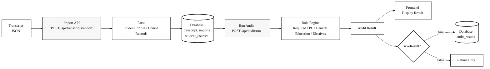
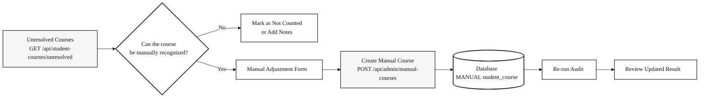

<p align="right">
  <a href="./README.zh-TW.md">
    
  </a>
  
</p>

# NCCU Mathematical Sciences Undergraduate Degree Audit Reporting System for Academic Years 111–114

## Degree Audit Reporting System

The **Degree Audit Reporting System (DARS)** is a computer-generated report for undergraduate and associate-level students. It compares a student's completed coursework with the requirements of a degree program and identifies both completed and remaining graduation requirements.

## Introduction

This repository is the final project for the **114-2 Database Systems** course.

The system allows students to import transcript JSON files downloaded from iNCCU and automatically evaluates whether the student satisfies the graduation requirements of the **NCCU Department of Mathematical Sciences undergraduate program**.

The current system focuses on the following modules:

### Student Portal

- Import transcript JSON files
- View imported course records
- Run degree audits
- View audit results and audit history

### Admin Portal

- Review unresolved courses
- Create manual course adjustments
- Query course data
- Query graduation rules
- View student audit records

### Backend

- Express API + Sequelize + MySQL
- Handles transcript import, rule evaluation, audit result persistence, and administrative adjustments

### Frontend

- React + Vite + TypeScript + Tailwind CSS
- Provides the user interface for transcript import, degree audit execution, and result visualization

> [!WARNING]
> Please do **not** upload real personal transcripts or sensitive academic records to the demo system.  
> Future improvements will include backend authentication, JWT/session management, role-based access control, and stricter authorization checks.

---

## Technology Stack

```text
Frontend:   React + Vite + TypeScript + Tailwind CSS
Backend:    Node.js + Express + Sequelize
Database:   MySQL
Container:  Docker Compose
```

---

## Project Structure

```text
1142-nccu-database-systems/
├── backend/                # Express API, Sequelize models, audit engine
├── frontend/               # React + Vite frontend application
├── data/                   # Course Excel files and demo transcript JSON files
├── docs/                   # API docs, backend design, assumptions, performance reports
├── performance/            # k6 load testing scripts
├── docker-compose.yml      # Local Docker Compose setup: MySQL + backend
├── requirement.txt         # System requirements and functional requirements
└── README.md
```

---

## Frontend–Backend Integration

The frontend does not access the database directly. All data operations are performed through backend API endpoints.

```text
User interaction
    ↓
React page / component
    ↓
frontend/src/api/hooks.ts
    ↓
frontend/src/api/client.ts
    ↓
HTTP API request
    ↓
backend/src/routes/*
    ↓
backend/src/controllers/*
    ↓
backend/src/services/*
    ↓
Sequelize models
    ↓
MySQL
```

During local development, the frontend calls:

```text
http://localhost:3001/api/...
```

When exposing the system through Cloudflare Tunnel for demo purposes, the frontend calls relative paths:

```text
/api/...
```

These requests are then proxied by the Vite development server to:

```text
http://localhost:3001
```

---

## System Workflow

The system consists of two major workflows:

1. Students upload transcript JSON files downloaded from iNCCU and run a graduation audit.
2. Administrators review courses that cannot be automatically classified and create manual adjustments.

### Transcript JSON to Degree Audit



### Administrative Manual Adjustment Workflow



---

## Graduation Requirement Model

The current system adopts a 128-credit graduation structure and evaluates credits according to course categories.

### Credit Structure

| Category | Credits | Description |
|---|---:|---|
| Department Required Courses | 51 | Evaluated according to the NCCU Applied Mathematics undergraduate curriculum |
| Required Physical Education | 4 | Checks whether the required PE credits have been completed |
| General Education | 28 | Evaluates language, core, humanities, social science, natural science, information literacy, and college-level requirements |
| Other Electives | 45 | Remaining countable credits after required courses, PE, and general education credits |
| **Total** | **128** | Minimum graduation credit requirement |

### General Education Requirements

The system checks the following general education categories:

```text
Chinese Language General Education
Foreign Language General Education
Humanities General Education
Social Science General Education
Natural Science General Education
Information Literacy General Education
College General Education
Core General Education
```

For **Core General Education**, the system explicitly lists the core-domain courses that the student has passed, making it easier to verify whether the student satisfies the graduation requirement.

---

## Environment Requirements

| Tool | Recommended Version |
|---|---|
| Docker Desktop | 4.0+ |
| Node.js | 18.0.0+ |
| npm | 9.0+ |
| cloudflared | Optional; only required for Cloudflare Tunnel demos |

---

## Quick Start

### 1. Create Backend Environment Variables

```bash
cp backend/.env.example backend/.env
```

Open `backend/.env` and configure the actual database username and password.

Also make sure the MySQL configuration in `docker-compose.yml` is consistent with `backend/.env`.

### 2. Start Backend and MySQL

Run the following command from the project root:

```bash
docker compose up -d --build
```

Check container status:

```bash
docker compose ps
```

Expected output:

```text
nccu-ams-mysql     Up / healthy
nccu-ams-backend   Up
```

Check backend health:

```bash
curl http://localhost:3001/api/health
```

Expected response:

```json
{"status":"ok"}
```

### 3. Seed Initial Data

After the database is created for the first time, import course data, demo transcript data, and test users.

```bash
docker compose exec backend npm run seed
docker compose exec backend npm run seed:transcript
docker compose exec backend npm run seed:k6-user
```

To reset demo data:

```bash
docker compose exec backend npm run reset:demo
```

### 4. Start the Frontend

Open another terminal:

```bash
cd frontend
npm install
npm run dev
```

The services will be available at:

| Service | URL |
|---|---|
| Frontend | `http://localhost:5173` |
| Backend API | `http://localhost:3001` |

---

## Free Online Demo with Cloudflare Tunnel

This project supports Cloudflare Tunnel for exposing the locally running system through a temporary public URL. This is useful for course presentations, demos, and remote testing.

### 1. Ensure the Backend Is Running

```bash
docker compose up -d
curl http://localhost:3001/api/health
```

### 2. Start the Frontend in Tunnel Mode

```bash
cd frontend
npm run dev -- --mode tunnel --host 0.0.0.0
```

### 3. Start Cloudflare Tunnel

```bash
cloudflared tunnel --url http://localhost:5173
```

If `cloudflared` was installed through Homebrew, you may also run:

```bash
/opt/homebrew/opt/cloudflared/bin/cloudflared tunnel --url http://localhost:5173
```

After the tunnel starts successfully, Cloudflare will provide a URL similar to:

```text
https://xxxx.trycloudflare.com
```

> [!NOTE]
> Cloudflare Quick Tunnel provides a free temporary public URL.  
> The URL is not guaranteed to be permanent.  
> Each tunnel restart may generate a different URL.  
> During the demo, the local machine, Docker containers, Vite development server, and `cloudflared` process must remain running.

---

## Common API Endpoints

### Health Check

```bash
curl http://localhost:3001/api/health
```

### Import Transcript JSON

```http
POST /api/transcripts/import
```

Purpose:

```text
Imports transcript data exported from iNCCU,
then creates records in transcript_imports and student_courses.
```

### Run Degree Audit

```bash
curl -X POST http://localhost:3001/api/audit/run \
  -H 'Content-Type: application/json' \
  -d '{"userId":1,"academicYear":"111","includeInProgress":false,"saveResult":true}'
```

| Parameter | Type | Description |
|---|---|---|
| `userId` | number | Student user ID to audit |
| `academicYear` | string | Applicable academic year, for example `111` |
| `includeInProgress` | boolean | Whether to include currently enrolled courses in the projected result |
| `saveResult` | boolean | Whether to persist the audit result into `audit_results` |

### Query Audit History

```http
GET /api/audit/history?userId=1&limit=20
```

### Query Unresolved Courses

```http
GET /api/student-courses/unresolved?userId=1
```

### Create Manual Course Adjustment

```http
POST /api/admin/manual-courses
```

Purpose:

```text
Allows administrators to create manually recognized, waived, transferred,
or approved substitute course records.
```

---

## Frontend Routes

### Student Portal

| Route | Description |
|---|---|
| `/student` | Student dashboard |
| `/student/import` | Import transcript JSON |
| `/student/courses` | View imported courses |
| `/student/audit/run` | Run degree audit |
| `/student/audit/result` | View audit result |
| `/student/audit/history` | View audit history |

### Admin Portal

| Route | Description |
|---|---|
| `/admin` | Admin dashboard |
| `/admin/unresolved` | Review unresolved courses |
| `/admin/manual-courses` | Create manual course adjustments |
| `/admin/courses` | Manage course data |
| `/admin/requirements` | Manage graduation requirements |
| `/admin/audit-history` | View audit records |

---

## Testing and Validation

### Backend Tests

```bash
cd backend
npm test
```

### Frontend Tests

```bash
cd frontend
npm test
```

### Frontend Production Build

```bash
cd frontend
npm run build
```

### Docker and API Checks

```bash
docker compose ps
curl http://localhost:3001/api/health
curl 'http://localhost:3001/api/courses?year=111&limit=3'
curl 'http://localhost:3001/api/curriculums/113/requirements'
```

### Load Testing

```bash
k6 run performance/k6-audit-test.js
```

---

## Command Reference

| Task | Command |
|---|---|
| Start Docker services | `docker compose up -d --build` |
| Check container status | `docker compose ps` |
| Seed course data | `docker compose exec backend npm run seed` |
| Seed demo transcript | `docker compose exec backend npm run seed:transcript` |
| Create k6 test user | `docker compose exec backend npm run seed:k6-user` |
| Reset demo data | `docker compose exec backend npm run reset:demo` |
| Start frontend | `cd frontend && npm run dev` |
| Run backend tests | `cd backend && npm test` |
| Run frontend tests | `cd frontend && npm test` |
| Build frontend | `cd frontend && npm run build` |
| Run load test | `k6 run performance/k6-audit-test.js` |

---

## License

This project is developed as a course final project and is intended for academic demonstration and learning purposes only.
