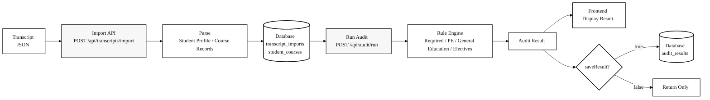
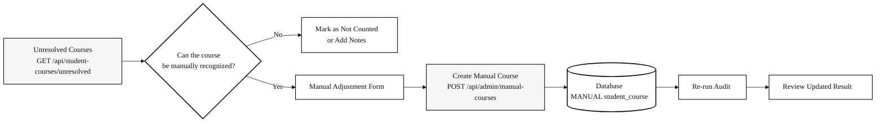
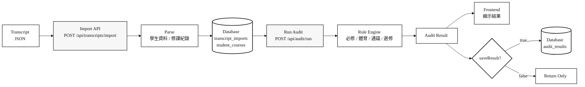
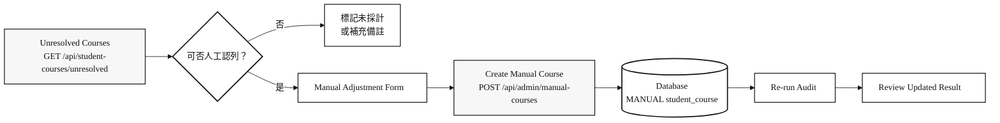

<div align="center">

# NCCU Mathematical Sciences Undergraduate Degree Audit Reporting System

### 111–114 Academic Years · 政大應數系學士班畢業審核系統

</div>

<p align="center">
  
  
  
  
  <br>
  
  
  
  
  <br>
  
  
  
  
</p>

> [!NOTE]
> This README is kept as a single file. Use the expandable language sections below to read the English or Traditional Chinese version without navigating to another README file.
>
> 此 README 採用單一檔案設計。請直接展開下方語言區塊閱讀英文版或繁體中文版，不需要跳轉到其他 README 檔案。

---

<details open>
<summary><strong>English README</strong></summary>

<br>

# NCCU Mathematical Sciences Undergraduate Degree Audit Reporting System for Academic Years 111–114

## Degree Audit Reporting System

The **Degree Audit Reporting System (DARS)** is a computer-generated report for undergraduate and associate-level students. It compares a student's completed coursework with the requirements of a degree program and identifies both completed and remaining graduation requirements.

## Introduction

This repository is the final project for the **114-2 Database Systems** course.

The system allows students to import transcript JSON files downloaded from iNCCU and automatically evaluates whether the student satisfies the graduation requirements of the **NCCU Department of Mathematical Sciences undergraduate program**.

The current system focuses on the following modules:

### Student Portal

- Import transcript JSON files
- View imported course records
- Run degree audits
- View audit results and audit history

### Admin Portal

- Review unresolved courses
- Create manual course adjustments
- Query course data
- Query graduation rules
- View student audit records

### Backend

- Express API + Sequelize + MySQL
- Handles transcript import, rule evaluation, audit result persistence, and administrative adjustments

### Frontend

- React + Vite + TypeScript + Tailwind CSS
- Provides the user interface for transcript import, degree audit execution, and result visualization

> [!WARNING]
> Please do **not** upload real personal transcripts or sensitive academic records to the demo system.  
> Future improvements will include backend authentication, JWT/session management, role-based access control, and stricter authorization checks.

---

## Technology Stack

```text
Frontend:   React + Vite + TypeScript + Tailwind CSS
Backend:    Node.js + Express + Sequelize
Database:   MySQL
Container:  Docker Compose
```

---

## Project Structure

```text
1142-nccu-database-systems/
├── backend/                # Express API, Sequelize models, audit engine
├── frontend/               # React + Vite frontend application
├── data/                   # Course Excel files and demo transcript JSON files
├── docs/                   # API docs, backend design, assumptions, performance reports
├── performance/            # k6 load testing scripts
├── docker-compose.yml      # Local Docker Compose setup: MySQL + backend
├── requirement.txt         # System requirements and functional requirements
└── README.md
```

---

## Frontend–Backend Integration

The frontend does not access the database directly. All data operations are performed through backend API endpoints.

```text
User interaction
    ↓
React page / component
    ↓
frontend/src/api/hooks.ts
    ↓
frontend/src/api/client.ts
    ↓
HTTP API request
    ↓
backend/src/routes/*
    ↓
backend/src/controllers/*
    ↓
backend/src/services/*
    ↓
Sequelize models
    ↓
MySQL
```

During local development, the frontend calls:

```text
http://localhost:3001/api/...
```

When exposing the system through Cloudflare Tunnel for demo purposes, the frontend calls relative paths:

```text
/api/...
```

These requests are then proxied by the Vite development server to:

```text
http://localhost:3001
```

---

## System Workflow

The system consists of two major workflows:

1. Students upload transcript JSON files downloaded from iNCCU and run a graduation audit.
2. Administrators review courses that cannot be automatically classified and create manual adjustments.

### Transcript JSON to Degree Audit



### Administrative Manual Adjustment Workflow



---

## Graduation Requirement Model

The current system adopts a 128-credit graduation structure and evaluates credits according to course categories.

### Credit Structure

| Category | Credits | Description |
|---|---:|---|
| Department Required Courses | 51 | Evaluated according to the NCCU Applied Mathematics undergraduate curriculum |
| Required Physical Education | 4 | Checks whether the required PE credits have been completed |
| General Education | 28 | Evaluates language, core, humanities, social science, natural science, information literacy, and college-level requirements |
| Other Electives | 45 | Remaining countable credits after required courses, PE, and general education credits |
| **Total** | **128** | Minimum graduation credit requirement |

### General Education Requirements

The system checks the following general education categories:

```text
Chinese Language General Education
Foreign Language General Education
Humanities General Education
Social Science General Education
Natural Science General Education
Information Literacy General Education
College General Education
Core General Education
```

For **Core General Education**, the system explicitly lists the core-domain courses that the student has passed, making it easier to verify whether the student satisfies the graduation requirement.

---

## Environment Requirements

| Tool | Recommended Version |
|---|---|
| Docker Desktop | 4.0+ |
| Node.js | 18.0.0+ |
| npm | 9.0+ |
| cloudflared | Optional; only required for Cloudflare Tunnel demos |

---

## Quick Start

### 1. Create Backend Environment Variables

```bash
cp backend/.env.example backend/.env
```

Open `backend/.env` and configure the actual database username and password.

Also make sure the MySQL configuration in `docker-compose.yml` is consistent with `backend/.env`.

### 2. Start Backend and MySQL

Run the following command from the project root:

```bash
docker compose up -d --build
```

Check container status:

```bash
docker compose ps
```

Expected output:

```text
nccu-ams-mysql     Up / healthy
nccu-ams-backend   Up
```

Check backend health:

```bash
curl http://localhost:3001/api/health
```

Expected response:

```json
{"status":"ok"}
```

### 3. Seed Initial Data

After the database is created for the first time, import course data, demo transcript data, and test users.

```bash
docker compose exec backend npm run seed
docker compose exec backend npm run seed:transcript
docker compose exec backend npm run seed:k6-user
```

To reset demo data:

```bash
docker compose exec backend npm run reset:demo
```

### 4. Start the Frontend

Open another terminal:

```bash
cd frontend
npm install
npm run dev
```

The services will be available at:

| Service | URL |
|---|---|
| Frontend | `http://localhost:5173` |
| Backend API | `http://localhost:3001` |

---

## Free Online Demo with Cloudflare Tunnel

This project supports Cloudflare Tunnel for exposing the locally running system through a temporary public URL. This is useful for course presentations, demos, and remote testing.

### 1. Ensure the Backend Is Running

```bash
docker compose up -d
curl http://localhost:3001/api/health
```

### 2. Start the Frontend in Tunnel Mode

```bash
cd frontend
npm run dev -- --mode tunnel --host 0.0.0.0
```

### 3. Start Cloudflare Tunnel

```bash
cloudflared tunnel --url http://localhost:5173
```

If `cloudflared` was installed through Homebrew, you may also run:

```bash
/opt/homebrew/opt/cloudflared/bin/cloudflared tunnel --url http://localhost:5173
```

After the tunnel starts successfully, Cloudflare will provide a URL similar to:

```text
https://xxxx.trycloudflare.com
```

> [!NOTE]
> Cloudflare Quick Tunnel provides a free temporary public URL.  
> The URL is not guaranteed to be permanent.  
> Each tunnel restart may generate a different URL.  
> During the demo, the local machine, Docker containers, Vite development server, and `cloudflared` process must remain running.

---

## Common API Endpoints

### Health Check

```bash
curl http://localhost:3001/api/health
```

### Import Transcript JSON

```http
POST /api/transcripts/import
```

Purpose:

```text
Imports transcript data exported from iNCCU,
then creates records in transcript_imports and student_courses.
```

### Run Degree Audit

```bash
curl -X POST http://localhost:3001/api/audit/run \
  -H 'Content-Type: application/json' \
  -d '{"userId":1,"academicYear":"111","includeInProgress":false,"saveResult":true}'
```

| Parameter | Type | Description |
|---|---|---|
| `userId` | number | Student user ID to audit |
| `academicYear` | string | Applicable academic year, for example `111` |
| `includeInProgress` | boolean | Whether to include currently enrolled courses in the projected result |
| `saveResult` | boolean | Whether to persist the audit result into `audit_results` |

### Query Audit History

```http
GET /api/audit/history?userId=1&limit=20
```

### Query Unresolved Courses

```http
GET /api/student-courses/unresolved?userId=1
```

### Create Manual Course Adjustment

```http
POST /api/admin/manual-courses
```

Purpose:

```text
Allows administrators to create manually recognized, waived, transferred,
or approved substitute course records.
```

---

## Frontend Routes

### Student Portal

| Route | Description |
|---|---|
| `/student` | Student dashboard |
| `/student/import` | Import transcript JSON |
| `/student/courses` | View imported courses |
| `/student/audit/run` | Run degree audit |
| `/student/audit/result` | View audit result |
| `/student/audit/history` | View audit history |

### Admin Portal

| Route | Description |
|---|---|
| `/admin` | Admin dashboard |
| `/admin/unresolved` | Review unresolved courses |
| `/admin/manual-courses` | Create manual course adjustments |
| `/admin/courses` | Manage course data |
| `/admin/requirements` | Manage graduation requirements |
| `/admin/audit-history` | View audit records |

---

## Testing and Validation

### Backend Tests

```bash
cd backend
npm test
```

### Frontend Tests

```bash
cd frontend
npm test
```

### Frontend Production Build

```bash
cd frontend
npm run build
```

### Docker and API Checks

```bash
docker compose ps
curl http://localhost:3001/api/health
curl 'http://localhost:3001/api/courses?year=111&limit=3'
curl 'http://localhost:3001/api/curriculums/113/requirements'
```

### Load Testing

```bash
k6 run performance/k6-audit-test.js
```

---

## Command Reference

| Task | Command |
|---|---|
| Start Docker services | `docker compose up -d --build` |
| Check container status | `docker compose ps` |
| Seed course data | `docker compose exec backend npm run seed` |
| Seed demo transcript | `docker compose exec backend npm run seed:transcript` |
| Create k6 test user | `docker compose exec backend npm run seed:k6-user` |
| Reset demo data | `docker compose exec backend npm run reset:demo` |
| Start frontend | `cd frontend && npm run dev` |
| Run backend tests | `cd backend && npm test` |
| Run frontend tests | `cd frontend && npm test` |
| Build frontend | `cd frontend && npm run build` |
| Run load test | `k6 run performance/k6-audit-test.js` |

---

## License

This project is developed as a course final project and is intended for academic demonstration and learning purposes only.

</details>

---

<details>
<summary><strong>繁體中文版 README</strong></summary>

<br>

# 111–114 學年度 政大應數系學士班畢業審核系統

## Degree Audit Reporting System

**畢業審核系統（Degree Audit Reporting System, DARS）** 是一套自動化學分檢核工具，用於比對學生已修習課程與學位畢業規則，並列出已完成與尚未完成的畢業條件。

## 專案簡介

本專案為 **114-2 資料庫系統** 期末專案。

系統可讓學生匯入從 iNCCU 下載的 transcript JSON 檔案，並依照 **國立政治大學應用數學系學士班** 的畢業規則，自動檢核學生是否符合畢業資格。

目前專案重點包含以下模組：

### 學生端

- 匯入 transcript JSON 檔案
- 查看已匯入的修課資料
- 執行畢業審核
- 查看審核結果與歷史紀錄

### 管理員端

- 查看待確認課程
- 建立人工調整課程
- 查詢課程資料
- 查詢畢業規則
- 查看學生審核紀錄

### 後端

- Express API + Sequelize + MySQL
- 負責 transcript 匯入、規則計算、審核結果儲存與人工調整

### 前端

- React + Vite + TypeScript + Tailwind CSS
- 負責 transcript 匯入、畢業審核執行與結果視覺化介面

> [!WARNING]
> 請勿將真實個人成績單或敏感學籍資料上傳至 demo 系統。  
> 未來改善方向包含後端 authentication、JWT/session 管理、role-based access control，以及更嚴格的授權檢查。

---

## 技術架構

```text
Frontend:   React + Vite + TypeScript + Tailwind CSS
Backend:    Node.js + Express + Sequelize
Database:   MySQL
Container:  Docker Compose
```

---

## 專案架構

```text
1142-nccu-database-systems/
├── backend/                # Express API、Sequelize models、audit engine
├── frontend/               # React + Vite 前端應用程式
├── data/                   # 課程 Excel 檔案與 demo transcript JSON
├── docs/                   # API 文件、後端設計、假設說明、效能報告
├── performance/            # k6 壓力測試腳本
├── docker-compose.yml      # 本機 Docker Compose：MySQL + backend
├── requirement.txt         # 系統需求與功能需求清單
└── README.md
```

---

## 前後端串接

前端不直接存取資料庫，所有資料操作皆透過後端 API endpoints 完成。

```text
使用者操作
    ↓
React page / component
    ↓
frontend/src/api/hooks.ts
    ↓
frontend/src/api/client.ts
    ↓
HTTP API request
    ↓
backend/src/routes/*
    ↓
backend/src/controllers/*
    ↓
backend/src/services/*
    ↓
Sequelize models
    ↓
MySQL
```

本機開發時，前端預設呼叫：

```text
http://localhost:3001/api/...
```

若使用 Cloudflare Tunnel 對外 demo，前端會改為呼叫相對路徑：

```text
/api/...
```

再由 Vite development server proxy 到：

```text
http://localhost:3001
```

---

## 系統流程

本系統主要包含兩個工作流程：

1. 學生上傳從 iNCCU 下載的 transcript JSON 檔案，並執行畢業審核。
2. 管理員檢視無法自動分類的課程，並建立人工調整紀錄。

### 從 Transcript JSON 到畢業審核



### 管理員人工調整流程



---

## 畢業規則模型

本系統目前採用 **128 學分畢業結構**，並依照課程類型進行自動檢核。

### 學分結構

| 類別 | 學分數 | 說明 |
|---|---:|---|
| 系必修 | 51 | 依政大應數系學士班課程規則檢核 |
| 體育必修 | 4 | 檢查體育必修學分是否完成 |
| 通識 | 28 | 檢查語文、核心、人文、社會、自然、資訊與書院等通識要求 |
| 其他選修 | 45 | 扣除必修、體育與通識後，其餘可採計選修學分 |
| **合計** | **128** | 畢業最低學分門檻 |

### 通識規則

系統會檢查以下通識類型：

```text
中國語文通識課程
外國語文通識課程
人文學通識
社會科學通識
自然科學通識
資訊通識
書院通識
核心通識
```

其中，**核心通識** 會明確列出學生已通過的核心領域課程，方便確認是否符合畢業要求。

---

## 環境需求

| 工具 | 建議版本 |
|---|---|
| Docker Desktop | 4.0+ |
| Node.js | 18.0.0+ |
| npm | 9.0+ |
| cloudflared | 選用；僅 Cloudflare Tunnel demo 需要 |

---

## 快速啟動

### 1. 建立後端環境變數

```bash
cp backend/.env.example backend/.env
```

請開啟 `backend/.env`，填入實際資料庫帳號與密碼。

同時確認 `docker-compose.yml` 中的 MySQL 設定與 `backend/.env` 一致。

### 2. 啟動後端與 MySQL

在專案根目錄執行：

```bash
docker compose up -d --build
```

確認 container 狀態：

```bash
docker compose ps
```

正常情況會看到：

```text
nccu-ams-mysql     Up / healthy
nccu-ams-backend   Up
```

確認後端健康狀態：

```bash
curl http://localhost:3001/api/health
```

正常回應：

```json
{"status":"ok"}
```

### 3. 匯入基礎資料

資料庫第一次建立後，需要匯入課程資料、demo transcript 資料與測試使用者資料。

```bash
docker compose exec backend npm run seed
docker compose exec backend npm run seed:transcript
docker compose exec backend npm run seed:k6-user
```

若需要重設 demo 資料：

```bash
docker compose exec backend npm run reset:demo
```

### 4. 啟動前端

另開一個 terminal：

```bash
cd frontend
npm install
npm run dev
```

啟動後可開啟：

| 服務 | URL |
|---|---|
| Frontend | `http://localhost:5173` |
| Backend API | `http://localhost:3001` |

---

## 免費線上 Demo：Cloudflare Tunnel

本專案支援透過 Cloudflare Tunnel 建立臨時公開網址，方便展示本機執行中的系統。此功能適合課堂展示、遠端 demo 與臨時測試。

### 1. 確認後端已啟動

```bash
docker compose up -d
curl http://localhost:3001/api/health
```

### 2. 以 tunnel 模式啟動前端

```bash
cd frontend
npm run dev -- --mode tunnel --host 0.0.0.0
```

### 3. 啟動 Cloudflare Tunnel

```bash
cloudflared tunnel --url http://localhost:5173
```

如果使用 Homebrew 安裝 `cloudflared`，也可以執行：

```bash
/opt/homebrew/opt/cloudflared/bin/cloudflared tunnel --url http://localhost:5173
```

成功後會得到類似以下的網址：

```text
https://xxxx.trycloudflare.com
```

> [!NOTE]
> Cloudflare Quick Tunnel 是免費臨時網址，不保證永久有效。  
> 每次重新啟動 tunnel，網址可能會更換。  
> 展示期間需保持本機電腦、Docker containers、Vite development server 與 `cloudflared` process 持續執行。

---

## 常用 API Endpoints

### 基礎檢查

```bash
curl http://localhost:3001/api/health
```

### 匯入 Transcript JSON

```http
POST /api/transcripts/import
```

用途：

```text
將 iNCCU 匯出的 transcript JSON 匯入資料庫，
並建立 transcript_imports 與 student_courses 紀錄。
```

### 執行畢業審核

```bash
curl -X POST http://localhost:3001/api/audit/run \
  -H 'Content-Type: application/json' \
  -d '{"userId":1,"academicYear":"111","includeInProgress":false,"saveResult":true}'
```

| 參數 | 型別 | 說明 |
|---|---|---|
| `userId` | number | 要審核的學生使用者 ID |
| `academicYear` | string | 適用學年度，例如 `111` |
| `includeInProgress` | boolean | 是否將修課中課程納入預估結果 |
| `saveResult` | boolean | 是否將審核結果儲存至 `audit_results` |

### 查詢審核歷史

```http
GET /api/audit/history?userId=1&limit=20
```

### 查詢待確認課程

```http
GET /api/student-courses/unresolved?userId=1
```

### 建立人工調整

```http
POST /api/admin/manual-courses
```

用途：

```text
讓管理員新增人工認列、抵免或核准替代課程。
```

---

## 前端頁面

### 學生端

| Route | 說明 |
|---|---|
| `/student` | 學生首頁 |
| `/student/import` | 匯入 transcript JSON |
| `/student/courses` | 查看已匯入課程 |
| `/student/audit/run` | 執行畢業審核 |
| `/student/audit/result` | 查看審核結果 |
| `/student/audit/history` | 查看歷史審核紀錄 |

### 管理員端

| Route | 說明 |
|---|---|
| `/admin` | 管理員首頁 |
| `/admin/unresolved` | 查看待確認課程 |
| `/admin/manual-courses` | 建立人工調整課程 |
| `/admin/courses` | 管理課程資料 |
| `/admin/requirements` | 管理畢業規則 |
| `/admin/audit-history` | 查看審核紀錄 |

---

## 測試與驗證

### 後端測試

```bash
cd backend
npm test
```

### 前端測試

```bash
cd frontend
npm test
```

### 前端 Production Build

```bash
cd frontend
npm run build
```

### Docker / API 檢查

```bash
docker compose ps
curl http://localhost:3001/api/health
curl 'http://localhost:3001/api/courses?year=111&limit=3'
curl 'http://localhost:3001/api/curriculums/113/requirements'
```

### 壓力測試

```bash
k6 run performance/k6-audit-test.js
```

---

## 專案啟動指令總覽

| 任務 | 指令 |
|---|---|
| 啟動 Docker services | `docker compose up -d --build` |
| 查看 container 狀態 | `docker compose ps` |
| 匯入基礎課程資料 | `docker compose exec backend npm run seed` |
| 匯入 demo transcript | `docker compose exec backend npm run seed:transcript` |
| 建立 k6 測試使用者 | `docker compose exec backend npm run seed:k6-user` |
| 重設 demo 資料 | `docker compose exec backend npm run reset:demo` |
| 啟動前端 | `cd frontend && npm run dev` |
| 後端測試 | `cd backend && npm test` |
| 前端測試 | `cd frontend && npm test` |
| 前端 build | `cd frontend && npm run build` |
| 壓力測試 | `k6 run performance/k6-audit-test.js` |

---

## 授權

本專案為課程期末專案，僅供學術展示與學習用途。

</details>
