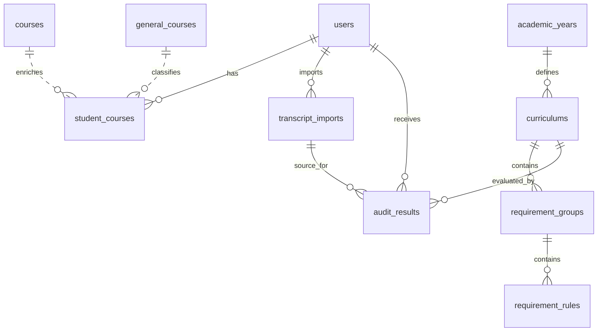

# ER Diagram

The original source ER diagram for `courses.xlsx` is copied to:

```text
docs/source-er.pdf
```

System ER relationships:



Source-data relationships:

```text
courses:
  semester + course_code is unique.

required_courses:
  year + course_code identifies required-course rows.

general_courses:
  academic_year + course_code identifies versioned general education course labels.

student_courses:
  stores transcript/manual courses plus department, course category, recognition type,
  approval status, substitution target, approval source, and approval note.
```
